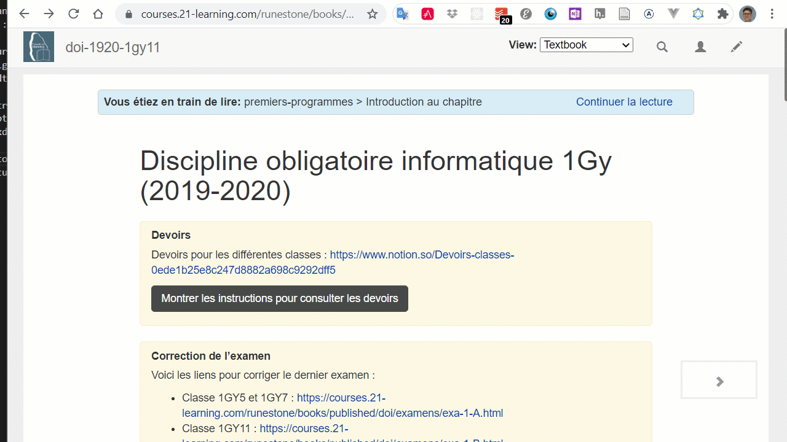

HOWTO
=====

..  contents:: Contenu de la page
    :depth: 3

J'ai oublié mon mot de passe
----------------------------

Si vous avez oublié votre mot de passe, il faut demander à votre professeur de
réinitialiser le mot de passe à l'aide du tableau de bord enseignant.

..  
    admonition:: Étapes

    #.  Sur le page de login du site, cliquer sur le bouton "Lost Password"
    
    #.  Insérer votre nom d'utilisateur. Votre nom d'utilisateur correspond à
        tous les caractères situés dans votre adresse de courriel
        **nom.prenom** ``@studentfr.ch`` avant le symbole ``@``. 

        ..  admonition:: Exemple
            :class: info

            Si votre adresse de courriel est ``albert.levert@studentfr.ch``,
            votre nom d'utilisateur (*username*) est ``albert.levert``)

    #.  Vous allez recevoir un courriel de la plateforme avec un lien permettant
        de changer votre mot de passe. Lorsque vous cliquez sur le lien, vous
        allez arriver sur une page qui fait peur et indique que le site Web
        n'est pas sécurisé

        ..  figure:: figures/trend-micro-alert.png
            :width: 90%

            Alerte de Trend Micro à ignorer

        Il suffit de cliquer sur le lien **Poursuivre vers ce site** saisir un
        nouveau mot de passe sur la page qui s'affiche.

        ..  admonition:: Attention
            :class: danger

            Vous n'avez pas le droit d'utiliser votre mot de passe du Collège
            pour la plateforme. Trouvez un autre mot de passe!

    #.  Tâchez de ne plus oublier votre mot de passe ...

Changement du mot de passe
--------------------------

    Changement du mot de passe

Changer de cours
----------------

Au moment du login, vous avez la possibilité de choisir le cours à utiliser. Il
n'est pas nécessaire de se déloguer pour changer de cours.

    Changer de cours sans se déloguer

Consulter sa progression dans le cours
--------------------------------------

Pour consulter votre progression, utilisez le menu "Progression"

Consulter les devoirs
---------------------

Enregistrer un programme
------------------------

L'enregistrement des programmes est automatique à chaque fois que le code est
exécuté à l'aide du bouton "play" vert. 

..  admonition:: Attention
    :class: attention

    Sur certains navigateurs, en particulier lorsque la connexion à Internet est
    lente ou que le serveur est surchargé, il arrive que les programme ne se
    sauvegardent pas chez certaines personnes. Il s'agit d'un bogue qui dont la
    cause n'a pas encore été clairement identifiée et difficilement reproductible. 

    Veillez à vérifier régulièrement que votre travail s'enregistre
    correctement. Si ce n'est pas le cas, faite une copie locale en enregistrant
    votre code dans un fichier sur votre machine avec l'extension de fichier
    ``.py``

Recharger un programme précédemment sauvegardé
----------------------------------------------

Pour recharher un programme précédemment enregistré automatiquement sur la
plateforme lors de son exécution, il suffit de cliquer sur le bouton "History"
et de bouger le curseur qui apparaît jusqu'à retrouver la version souhaitée du
programme.